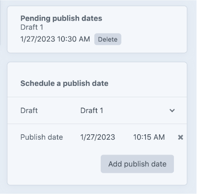

# Publisher X

Publisher X enables you to publish saved Drafts on a future date without 
the need to handle the cache expiration logic. 
The cronjob handles the publication and the cache invalidation.

It also handles entries which are to expire or published in the 
future correctly and will invalidate the cache.



## Installation

Install using `composer require goldinteractive/craft-publisher` and install in Craft.

## Setup

Setup a Cron Job which runs *every minute*.

Call it via CLI or web:

Web:
```shell
* * * * * /usr/bin/curl --silent --compressed {siteUrl}/actions/publisher-x/api/publish
```

CLI:
```shell
* * * * * [PATH_TO_CRAFT_INSTALLATION]/craft publisher-x/publish
```

### Usage with cache plugins
If you have a fullpage cache plugin like blitz installed, which refreshes it's cache over the queue, make sure you setup a cronjob which runs the queue too.
(`craft queue/run`)